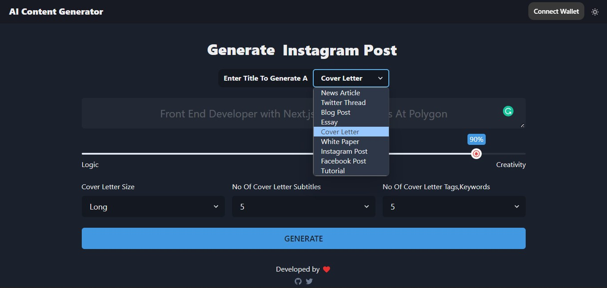

# AI NFT GENERATOR

A Next.js App That Generates Articles, Twitter Threads, Essays, Cover Letters, Tutorials And More Using OpenAI ⚡



### [Live Demo on Vercel](https://ai-post-generator.vercel.app/)

### To be done 

- Fine-Tunning The Model
- Posting articles on the blockchain (cheap ones)
- Showing articles that are posted on the blockchain 

## Features ✅

- [Nexth](https://github.com/wslyvh/nexth)
- [OpenAI API](https://github.com/openai/openai-node)
- [Next.js](https://nextjs.org/docs)
- [Chakra UI](https://chakra-ui.com/)
- [ethers.js](https://docs.ethers.org/)
- [wagmi](https://wagmi.sh/)
- [ConnectKit](https://docs.family.co/connectkit/)
- [Sign-In with Ethereum](https://www.login.xyz/)
- [usehooks-ts](https://usehooks-ts.com/)
- [next-SEO](https://github.com/garmeeh/next-seo)

## Developer Experience 🧰

- [TypeScript](https://www.typescriptlang.org/)
- [eslint](https://eslint.org/)
- [prettier](https://prettier.io/)
- [Husky](https://typicode.github.io/husky/)

## Development 🛠️

```bash
npm run dev
# or
yarn dev
```

## Deploy on Vercel 🚢

The easiest way to deploy your Next.js app is to use the [Vercel Platform](https://vercel.com/new?utm_medium=nexth&filter=next.js&utm_source=nexth&utm_campaign=nexth-readme) from the creators of Next.js.

Check out our [Next.js deployment documentation](https://nextjs.org/docs/deployment) for more details.
